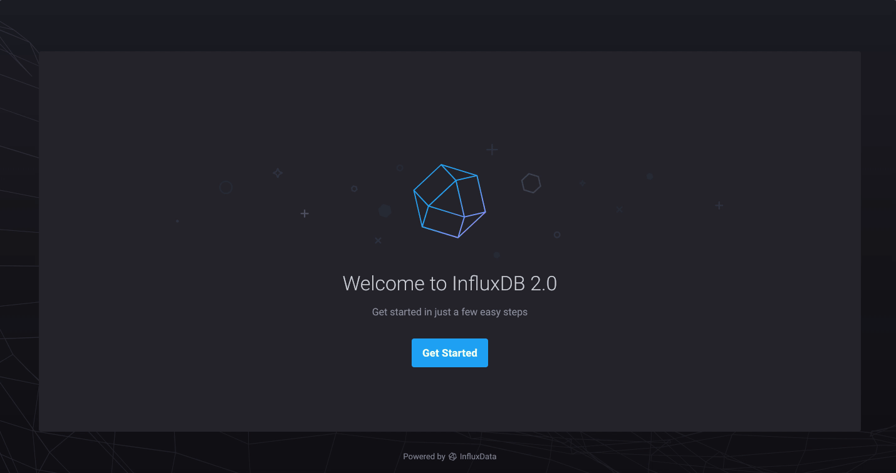

# Deploy InfluxDB v2 behind Traefik with SSL support in DigitalOcean.
---
**NOTE**

At the time this recipe was created, InfluxDB v2 is still in Beta. This Terraform recipe was made and tested with Beta 16. Please don't use this in production. When InfluxDB v2.0 reaches GA, this recipe will be updated accordingly. You can stay updated about the launch of v2.0 from [here](https://github.com/influxdata/influxdb/releases).

---

## What it is?

This is what I call a Terraform recipe, was made with the purpose of share what I learned and make the life of the community more easy and simple taking advantage of the automation.

## What Technologies this recipe is "touching"?

This recipe is made with Terraform 0.13.2, involve the deployment Docker and docker-compose package, InfluxDB v2.0 Beta 16, Traefik as Reverse Proxy with Let's Encrypt (SSL) support, creation of the droplet (Virtual Machine), shipment of a SSH public key and DNS configuration on DigitalOcean. Eight technologies in a recipe, sounds cool, right?

## How can I use this recipe?

Follow this step to start to using this recipe:

* Create a DigitalOcean Account with [this link](https://m.do.co/c/c8aa8e5fd348). Please, use the link to get $100 to try DigitalOcean.
* Get a Read & Write [token key](https://cloud.digitalocean.com/account/api/tokens) from DigitalOcean.
* Pass your token as environment variable running <code>$ export TF_VAR_digitalocean_token="your-token".</code>
* Edit your dns.tf file with your domain.
* Edit the docker-compose.yml file defining your email address and the URL for the InfluxDB container.
* If you want a bigger instance to run InfluxDB, you can change the size of the droplet in the droplet.tf file.
* ssh.tf file is taking your public SSH key (id_rsa.pub). Remember change the path according the location of this file. 

Once this small changes are done, you need to init your recipe. For doing this run:

<pre><code>$ terraform init</code></pre>

You will see an output like this:

<pre><code>Initializing the backend...

Initializing provider plugins...
- Finding latest version of hashicorp/null...
- Finding latest version of digitalocean/digitalocean...
- Installing hashicorp/null v2.1.2...
- Installed hashicorp/null v2.1.2 (signed by HashiCorp)
- Installing digitalocean/digitalocean v1.22.2...
- Installed digitalocean/digitalocean v1.22.2 (signed by a HashiCorp partner, key ID F82037E524B9C0E8)

Partner and community providers are signed by their developers.
If you'd like to know more about provider signing, you can read about it here:
https://www.terraform.io/docs/plugins/signing.html

The following providers do not have any version constraints in configuration,
so the latest version was installed.

To prevent automatic upgrades to new major versions that may contain breaking
changes, we recommend adding version constraints in a required_providers block
in your configuration, with the constraint strings suggested below.

* digitalocean/digitalocean: version = "~> 1.22.2"
* hashicorp/null: version = "~> 2.1.2"

Terraform has been successfully initialized!</code></pre>

The following thing to do is create a plan. You can do this running:

<pre><code>$ terraform plan</code></pre>

You will see an output like this:

<pre><code>Refreshing Terraform state in-memory prior to plan...
The refreshed state will be used to calculate this plan, but will not be
persisted to local or remote state storage.

------------------------------------------------------------------------

An execution plan has been generated and is shown below.
Resource actions are indicated with the following symbols:
  + create

Terraform will perform the following actions:

  # digitalocean_domain.cduser will be created
  + resource "digitalocean_domain" "cduser" {
      + id   = (known after apply)
      + name = "cduser.com"
      + urn  = (known after apply)
    }

  # digitalocean_droplet.influxdb will be created
  + resource "digitalocean_droplet" "influxdb" {
      + backups              = false
      + created_at           = (known after apply)
      + disk                 = (known after apply)
      + id                   = (known after apply)
      + image                = "ubuntu-20-04-x64"
      + ipv4_address         = (known after apply)
      + ipv4_address_private = (known after apply)
      + ipv6                 = false
      + ipv6_address         = (known after apply)
      + ipv6_address_private = (known after apply)
      + locked               = (known after apply)
      + memory               = (known after apply)
      + monitoring           = false
      + name                 = "influxdb"
      + price_hourly         = (known after apply)
      + price_monthly        = (known after apply)
      + private_networking   = (known after apply)
      + region               = "nyc1"
      + resize_disk          = true
      + size                 = "s-1vcpu-1gb"
      + ssh_keys             = (known after apply)
      + status               = (known after apply)
      + urn                  = (known after apply)
      + user_data            = "8e8667350e70e051949e95c4ca5f40e09870abf7"
      + vcpus                = (known after apply)
      + volume_ids           = (known after apply)
      + vpc_uuid             = (known after apply)
    }

  # digitalocean_record.influx will be created
  + resource "digitalocean_record" "influx" {
      + domain = "digitalocean_domain.cduser.name"
      + fqdn   = (known after apply)
      + id     = (known after apply)
      + name   = "influx"
      + ttl    = 35
      + type   = "A"
      + value  = "digitalocean_droplet.influxdb.ipv4_address"
    }

  # digitalocean_ssh_key.influx will be created
  + resource "digitalocean_ssh_key" "influx" {
      + fingerprint = (known after apply)
      + id          = (known after apply)
      + name        = "influx"
      + public_key  = "id_rsa.pub"
    }

  # null_resource.copy-docker-compose will be created
  + resource "null_resource" "copy-docker-compose" {
      + id = (known after apply)
    }

Plan: 5 to add, 0 to change, 0 to destroy.

------------------------------------------------------------------------

Note: You didn't specify an "-out" parameter to save this plan, so Terraform
can't guarantee that exactly these actions will be performed if
"terraform apply" is subsequently run.</code></pre>

If everything look good. Then, you need to run:

<pre><code>$ terraform apply</code></pre>

Type: "yes"

The output is like this:

<pre><code>digitalocean_ssh_key.influx: Creating...
digitalocean_ssh_key.influx: Creation complete after 3s [id=28453867]
digitalocean_droplet.influxdb: Creating...
digitalocean_droplet.influxdb: Still creating... [10s elapsed]
digitalocean_droplet.influxdb: Still creating... [20s elapsed]
digitalocean_droplet.influxdb: Creation complete after 24s [id=208013743]
null_resource.copy-test-file: Creating...
null_resource.copy-test-file: Provisioning with 'file'...
null_resource.copy-test-file: Still creating... [10s elapsed]
null_resource.copy-test-file: Creation complete after 20s [id=8765686804275944894]
Apply complete! Resources: 3 added, 0 changed, 0 destroyed.</code></pre>

After one/two minutes of deploy and depends of the propagation of the DNS record, you will able to see the Onboarding page of InfluxDB v2.0 when you visit https://influx.your-domain.com.

## What's Next

The next thing to do is add a step to automate the setup of InfluxDB v2.0, but I want to wait to the GA release.

## I think this recipe can be better

You're invited to contribute with this recipe. Fork this repo and propose changes.